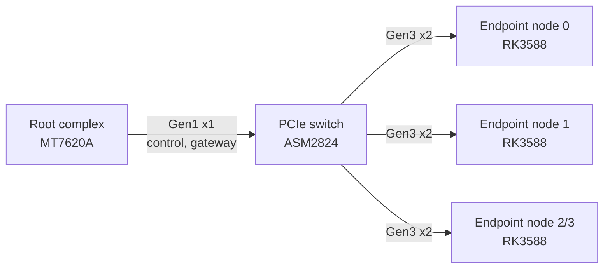
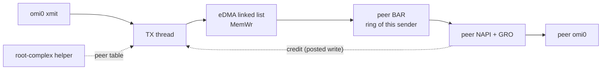

# pcie-ep-net

Peer-to-peer Ethernet for PCIe endpoints. Frames between endpoints are
DMA writes into the peer BAR: they cross the switch and do not enter
the root complex. The root complex only publishes BAR addresses and
bridges a slow gateway.

The driver and the on-wire header are still named `openmiop` (`omi0`,
magic `OMI1`). That is the implementation name. This repository is not
Mixtile MIOP and does not contain it.

License: GPL-2.0-or-later. See [LICENSE](LICENSE).

## What it is

An RK3588 in endpoint mode exposes one 16 MiB BAR. A small helper on the
root complex numbers the endpoints by slot, publishes a peer table into
every BAR and bridges a slow gateway ring. Blade-to-blade frames are
`MemWr` TLPs from the sender's eDMA engine into the receiver's BAR; they
cross the PCIe switch and never enter the root complex.

Protocol v4 supports any number of endpoints behind the switch (up to 8
nodes, 4 receive rings per BAR in this layout), recovers from module
reloads and host link resets, and keeps all endpoint-to-endpoint
communication write-only. See [docs/architecture.md](docs/architecture.md).

Measured on two RK3588 endpoints behind an ASMedia ASM2824, link
Gen3 x2, MTU 9000, 2026-10-06 (`docs/bench/2026-10-06-v4.2-*`): 8.0-8.3
Gbit/s TCP one way, ~15.8 Gbit/s bidirectional, ~7.4 Gbit/s with 4 or 8
streams, 0 retransmits, 0.6-0.8 % idle CPU, 0.3 ms RTT. Gen3 x2 raw is
about 16 Gbit/s per direction.

PCI ID is `1d87:4f4d` (Rockchip vendor id, development device id).
It is not `4586:b6f2`.

## Topology

The switch fans out to the blades. The uplink to the root complex is
Gen1 x1: enough for control and the gateway, not for blade traffic.



## Data path



## Documents

* [architecture.md](docs/architecture.md): topology, BAR layout,
  control plane, data path, memory ordering, L2 semantics, P2P proof,
  limitations
* [talos-port.md](docs/talos-port.md): what Talos 1.14.2 needed
* [operations.md](docs/operations.md): install, addresses, health,
  recovery
* [baseline.md](docs/baseline.md): protocol v3 as found, before changes
* [phase1-runbook.md](docs/phase1-runbook.md), [feasibility.md](docs/feasibility.md):
  the original pci_epf_test exploration (historical)
* `docs/bench/`: benchmark reports (`scripts/bench.sh`)

## Build

The endpoint module is out of tree, against the board's 6.1 headers:

```sh
make -C drivers/openmiop KDIR=/usr/src/linux-headers-6.1-rockchip
```

The module also builds unchanged against 6.18 (Talos; see
docs/talos-port.md).

The root-complex helper (`openmiop-rc`) and the `omi-peek` diagnostic are
freestanding MIPS32 soft-float binaries. A glibc build is hard-float and
will SIGILL on the MT7620A.

```sh
make -C userspace
```

GitHub Actions compiles the helper with `gcc-mipsel-linux-gnu` and the
module against upstream `linux-6.1.y`. That tree is GPL and is not the
board vendor kernel. The workflow does not download proprietary
modules.

## What is not in this tree

* Proprietary endpoint or switch drivers, firmware, and their PCI ID.
* Register traces or disassembly of those drivers.
* A claim that the Gen3 x4 / ~19 Gbit/s configuration is what this
  board negotiates. On the image measured here the PHY is bifurcated:
  two lanes to the switch, two lanes to the on-board NVMe. Width is
  read from `LnkSta`, not from the advertised capability.
