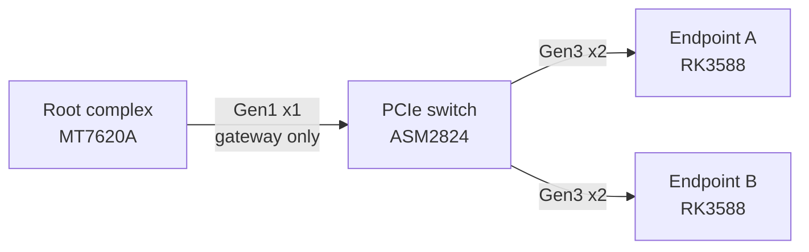
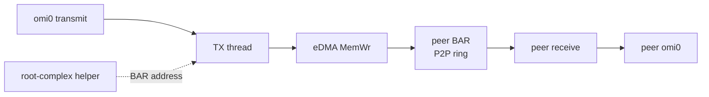

# pcie-ep-net

Peer-to-peer Ethernet for PCIe endpoints. Frames between endpoints are
DMA writes into the peer BAR: they cross the switch and do not enter
the root complex. The root complex only publishes BAR addresses and
bridges a slow gateway.

The driver and the on-wire header are still named `openmiop` (`omi0`,
magic `OMI1`). That is the implementation name. This repository is not
Mixtile MIOP and does not contain it.

License: GPL-2.0-or-later. See [LICENSE](LICENSE).

## What it is

An RK3588 in endpoint mode exposes one 16 MiB BAR. A small helper on
the root complex writes each endpoint's BAR address into the other.
After that, blade-to-blade packets are `MemWr` TLPs from the endpoint
eDMA engine. The root-complex CPU is not on that path.

Measured on two RK3588 endpoints behind an ASMedia ASM2824, link
Gen3 x2, MTU 9000, 2026-10-05: about 7.8 Gbit/s TCP one way. Gen3 x2
raw is about 16 Gbit/s. A second DMA channel does not add bandwidth;
both channels share one write pipe.

PCI ID is `1d87:4f4d` (Rockchip vendor id, development device id).
It is not `4586:b6f2`.

## Topology

The switch fans out to the blades. The uplink to the root complex is
only wide enough for the gateway, not for blade-to-blade traffic.



## Data path

Gateway frames use a small ring in the BAR and can be copied by the
root complex. Everything else is one DMA from the sender's DRAM into
the peer BAR.



## Build

The endpoint module is out of tree, against the board's 6.1 headers:

```sh
make -C drivers/openmiop KDIR=/usr/src/linux-headers-6.1-rockchip
```

The root-complex helper is a freestanding MIPS32 soft-float binary.
A glibc build is hard-float and will SIGILL on the MT7620A.

```sh
make -C userspace
```

GitHub Actions compiles the helper with `gcc-mipsel-linux-gnu` and the
module against upstream `linux-6.1.y`. That tree is GPL and is not the
board vendor kernel. The workflow does not download proprietary
modules.

## What is not in this tree

* Proprietary endpoint or switch drivers, firmware, and their PCI ID.
* Register traces or disassembly of those drivers.
* A claim that the Gen3 x4 / ~19 Gbit/s configuration is what this
  board negotiates. On the image measured here the PHY is bifurcated:
  two lanes to the switch, two lanes to the on-board NVMe. Width is
  read from `LnkSta`, not from the advertised capability.
